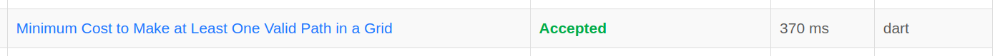

# 1368. Minimum Cost to Make at Least One Valid Path in a Grid

### Link Questão: [1368. Minimum Cost to Make at Least One Valid Path in a Grid](https://leetcode.com/problems/minimum-cost-to-make-at-least-one-valid-path-in-a-grid/description/)

#### Nível: Difícil

#### Linguagem utilizada: Dart

---

## Resultado Juiz Eletrônico (LeetCode)

<center> 




</center>

## Resumo

- O problema consiste em encontrar o menor caminho da posição **(0, 0)** até a posição **(m - 1, n - 1)**, de uma _grid_ (grade), ou seja, o menor caminho da primeira posição da primeira linha, até a ultima posição da ultima linha.

- Cada posição da grade pode ser interpretada como um nó.

- Esses nós estão ligados aos seus vizinhos das quatro direções (esquerda, direita, cima e baixo) por arestas, que possuem um custo.

- Esses nós também possuem um valor que indica uma direção, percorrer para o vizinho desse nó na direção armazenada por ele não tem custo, mas percorrer para um vizinho em uma das outras direções tem custo 1.

- Tendo isso em mente, é possível utilizar o algoritmo de Dijkstra para encontrar o menor caminho.

## Solução

### Arquivo: [1368.Minimum_Cost_to_Make_at_Least_One_Valid_Path_in_a_Grid.dart](./1368.Minimum_Cost_to_Make_at_Least_One_Valid_Path_in_a_Grid.dart)

### Código em Dart:

```dart
class No {
  // Custo para atingir vindo de (0, 0):
  double distancia;

  // Posição X do nó:
  final int x;

  // Posição Y do nó:
  final int y;

  // Construtor:
  No(this.x, this.y, this.distancia);
}

class Heap {
  final List<No> _heap = [];

  // Ver Raiz
  No? get verMenor => _heap.isEmpty ? null : _heap.first;

  // Adiciona um no
  void inserir(int x, int y, double distancia) {
    No no = No(x, y, distancia);

    // Adiciona no
    _heap.add(no);

    // ShiftUp
    _shiftUp(_heap.length - 1);
  }

  // Remove e retorna o menor no
  No? removerMenor() {
    if (_heap.isEmpty) return null;

    final No menorValor = _heap.first;

    // Substitui a raiz pelo último no e faz Heapfy
    _heap[0] = _heap.last;
    _heap.removeLast();

    if (_heap.isNotEmpty) _heapfy(0);

    // Retorna o menor no
    return menorValor;
  }

  void _shiftUp(int indice) {
    // Verifica se não é a raiz
    while (indice > 0) {
      // Pai do indice atual
      final indicePai = (indice - 1) ~/ 2;

      // Verifica se o atual é menor que o pai
      if (_heap[indice].distancia < (_heap[indicePai].distancia)) {
        // Troca
        _swap(indice, indicePai);

        // Atualiza indice
        indice = indicePai;
      } else {
        break;
      }
    }
  }

  void _heapfy(int indice) {
    // Ultimo indice
    final ultimoIndice = _heap.length - 1;

    while (true) {
      // Filhos da esquerda e direita
      final filhoEsquerda = 2 * indice + 1;
      final filhoDireita = 2 * indice + 2;

      // Menor indice
      int menorIndice = indice;

      // Verifica se o indice "filho da esquerda" está na heap, e se é menor que o de cima:
      if (filhoEsquerda <= ultimoIndice &&
          _heap[filhoEsquerda].distancia < (_heap[menorIndice].distancia)) {
        // Atualia o menor indice:
        menorIndice = filhoEsquerda;
      }

      // Verifica se o indice "filho da direita" está na heap, e se é menor que o de cima:
      if (filhoDireita <= ultimoIndice &&
          _heap[filhoDireita].distancia < (_heap[menorIndice].distancia)) {
        // Atualiza o menor indice:
        menorIndice = filhoDireita;
      }

      // Se chegou na raiz, para:
      if (menorIndice == indice) break;

      // Troca com a raiz pois é menor:
      _swap(indice, menorIndice);

      // Atualiza para continuar descendo na heap e verificando:
      indice = menorIndice;
    }
  }

  // Troca dois Nos
  void _swap(int a, int b) {
    final temp = _heap[a];
    _heap[a] = _heap[b];
    _heap[b] = temp;
  }

  // Retorna a heap para visualizar
  List<No> get nos => List.unmodifiable(_heap);
}

class Solution {
  // Direções de "movimento" possíveis:
  List<List<int>> direcoes = [
    [0, 1], // Direita
    [0, -1], // Esquerda
    [1, 0], // Baixo
    [-1, 0] // Cima
  ];

  int minCost(List<List<int>> grid) {
    // Custo final:
    double custo = -1;

    // Tamanho da Grid:
    int linhas = grid.length;
    int colunas = grid[0].length;

    // Matriz Distâncias:
    List<List<double>> distancias =
        List.generate(linhas, (_) => List.filled(colunas, double.infinity));

    // Heap:
    final Heap heap = Heap();

    // Adiciona o nó inicial:
    heap.inserir(0, 0, 0.0);

    while (heap.nos.isNotEmpty) {
      // Pega o menor no e Heapfy:
      final No menorNo = heap.removerMenor()!;

      // Verifica se chegou na última posição da Grid:
      if (menorNo.x == linhas - 1 && menorNo.y == colunas - 1) {
        if (menorNo.distancia == double.infinity)
          custo = -1;
        else {
          // Atualiza o custo total:
          custo = menorNo.distancia;
          break;
        }
      }

      // Verifica as direções possíveis:
      for (int i = 0; i < direcoes.length; i++) {
        int x = menorNo.x + direcoes[i][0];
        int y = menorNo.y + direcoes[i][1];

        // Verifica se está fora da Grid e pula essa iteração:
        if (x < 0 || x >= linhas || y < 0 || y >= colunas) continue;

        // Calcula o custo da distância (verifica se a direção do nó é a necessária):
        double custoDistancia =
            menorNo.distancia + (grid[menorNo.x][menorNo.y] == i + 1 ? 0 : 1);

        // Adiciona na heap:
        if (custoDistancia < distancias[x][y]) {
          distancias[x][y] = custoDistancia;
          heap.inserir(x, y, custoDistancia);
        }
      }
    }

    return custo.toInt();
  }
}
```