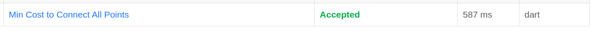
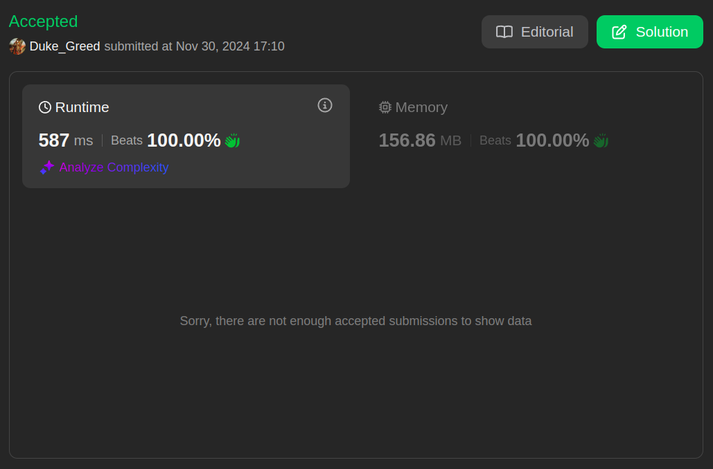

# 1584. Min Cost to Connect All Points

- **Link Questão:** [1584. Min Cost to Connect All Points](https://leetcode.com/problems/min-cost-to-connect-all-points/description/)

- **Nível:** Médio

- **Linguagem utilizada:** Dart

<br>

## Resultado Juiz Eletrônico (LeetCode)

<center> 





</center>

## Resumo

- O problema consiste em encontrar o custo mínimo para conectar todos os pontos em um plano.

- A distância entre dois pontos é a dado pela distância de Manhattan.

- Os pontos podem ser representados com um Nó de um grafo, dessa forma, é possível utilizar o algortimo de Prim para encontrar o custo mínimo.

## Solução

- **Arquivo:** [1584.Min_Cost_to_Connect_All_Points.dart](./1584.Min_Cost_to_Connect_All_Points.dart)

### Código:

```dart
class No {
  // Identificador do no:
  final String id;

  // Posicao do no (x, y):
  final Map<String, int> posicao;

  // Construtor:
  No(this.id, this.posicao);
}

class Grafo {
  // "Lista" de adjacências:
  final List<No> Nos = [];

  // Quantidade de nós no grafo:
  int qntdNos = 0;

  void addNo(int x, int y) {
    // Cria um novo Nó:
    No novoNo = No('$x|$y', {'x': x, 'y': y});

    // Adiciona o Nó na Lista de Nós:
    Nos.add(novoNo);

    // Incrementa a quantidade de nós no grafo:
    qntdNos++;
  }

  No? getNo(String id) {
    // Procura o Nó pelo ID na Lista de Nós:
    for (var no in Nos) {
      if (no.id == id) {
        return no;
      }
    }

    // Retorna null caso não encontre o Nó:
    return null;
  }

  void printGrafo() {
    // Percorre os nós da Lista de adjacências:
    for (var no in Nos) {
      // Printa o ID do Nó e o ID dos seus Vizinhos no console:

      print('Nó: ${no.id}');
    }
  }
}

class Hash {
  final Map<int, List<ElementoHeap>> _hash = {};

  int hashSize = 0;

  int _hashFunction(int x, int y) {
    return (x.abs() + y.abs()).abs() % hashSize;
  }

  void add(ElementoHeap noHeap) {
    var x = noHeap.noId.split('|')[0];
    var y = noHeap.noId.split('|')[1];

    var pos = _hashFunction(int.parse(x), int.parse(y));

    if (_hash[pos] == null) {
      _hash[pos] = [];
    }

    _hash[pos]!.add(noHeap);
  }

  ElementoHeap? get(String id) {
    var x = id.split('|')[0];
    var y = id.split('|')[1];

    var pos = _hashFunction(int.parse(x), int.parse(y));

    for (var no in _hash[pos]!) {
      if (no.noId == id) {
        return no;
      }
    }

    return null;
  }

  void remove(String id) {
    var x = id.split('|')[0];
    var y = id.split('|')[1];

    var pos = _hashFunction(int.parse(x), int.parse(y));

    for (var no in _hash[pos]!) {
      if (no.noId == id) {
        _hash[pos]?.remove(no);
        break;
      }
    }
  }

  void printHash() {
    for (var i = 0; i < hashSize; i++) {
      print('Posição: $i');

      if (_hash[i] != null) {
        for (var no in _hash[i]!) {
          print('No: ${no.noId}');
        }
      }
    }
  }
}

class ElementoHeap {
  // Custo da aresta:
  double distancia = double.infinity;

  // Nó onde a aresta chega:
  final String noId;

  // Nó onde a aresta sai:
  String noVindo = "";

  // Construtor:
  ElementoHeap(this.noId);
}

class Heap {
  final List<ElementoHeap> _heap = [];

  // Adiciona um elemento
  void inserir(String no) {
    ElementoHeap elemento = ElementoHeap(no);

    // Adiciona elemento
    _heap.add(elemento);
  }

  void atualizarElemento(String id, double distancia, String noVindo) {
    // Procura o elemento
    final elemento = _heap.firstWhere((elemento) => elemento.noId == id);

    // Atualiza o elemento
    elemento.distancia = distancia;
    elemento.noVindo = noVindo;

    _shiftUp(_heap.indexOf(elemento));
  }

  // Remove e retorna o menor elemento
  ElementoHeap? removerMenor() {
    if (_heap.isEmpty) return null;

    final ElementoHeap menorValor = _heap.first;

    // Substitui a raiz pelo último elemento e faz Heapfy
    _heap[0] = _heap.last;
    _heap.removeLast();

    if (_heap.isNotEmpty) _heapfy(0);

    // Retorna o menor elemento
    return menorValor;
  }

  void _shiftUp(int indice) {
    // Verifica se não é a raiz
    while (indice > 0) {
      // Pai do indice atual
      final indicePai = (indice - 1) ~/ 2;

      // Verifica se o atual é menor que o pai
      if (_heap[indice].distancia < (_heap[indicePai].distancia)) {
        // Troca
        _swap(indice, indicePai);

        // Atualiza indice
        indice = indicePai;
      } else {
        break;
      }
    }
  }

  void _heapfy(int indice) {
    // Ultimo indice
    final ultimoIndice = _heap.length - 1;

    while (true) {
      // Filhos da esquerda e direita
      final filhoEsquerda = 2 * indice + 1;
      final filhoDireita = 2 * indice + 2;

      // Menor indice
      int menorIndice = indice;

      // Verifica se o indice "filho da esquerda" está na heap, e se é menor que o de cima:
      if (filhoEsquerda <= ultimoIndice &&
          _heap[filhoEsquerda].distancia < (_heap[menorIndice].distancia)) {
        // Atualia o menor indice:
        menorIndice = filhoEsquerda;
      }

      // Verifica se o indice "filho da direita" está na heap, e se é menor que o de cima:
      if (filhoDireita <= ultimoIndice &&
          _heap[filhoDireita].distancia < (_heap[menorIndice].distancia)) {
        // Atualiza o menor indice:
        menorIndice = filhoDireita;
      }

      // Se chegou na raiz, para:
      if (menorIndice == indice) break;

      // Troca com a raiz pois é menor:
      _swap(indice, menorIndice);

      // Atualiza para continuar descendo na heap e verificando:
      indice = menorIndice;
    }
  }

  // Troca dois Elementos
  void _swap(int a, int b) {
    final temp = _heap[a];
    _heap[a] = _heap[b];
    _heap[b] = temp;
  }

  // Retorna a heap para visualizar
  List<ElementoHeap> get elementos => List.unmodifiable(_heap);
}

class Solution {
  int minCostConnectPoints(List<List<int>> points) {
    int custo = 0;

    final Grafo grafo = Grafo();

    // Adiciona os nós no grafo:
    for (var point in points) {
      grafo.addNo(point[0], point[1]);
    }

    final Heap heap = Heap();

    // Adiciona todos nós no heap:
    for (var no in grafo.Nos) {
      heap.inserir(no.id);
    }

    // Enquanto a heap não estiver vazia:
    while (heap.elementos.isNotEmpty) {
      // Remove o menor elemento da heap e heapfy:
      final ElementoHeap raizHeap = heap.removerMenor()!;

      if (raizHeap.distancia == double.infinity) {
      } else {
        custo += (raizHeap.distancia).toInt();
      }

      int x1 = int.parse(raizHeap.noId.split('|')[0]);
      int y1 = int.parse(raizHeap.noId.split('|')[1]);

      // Verifica a distância manhattan entre o nó e todos os outros nós:
      for (ElementoHeap noVizinho in heap.elementos) {
        // Se o nó for o mesmo, pula:
        if (noVizinho.noId == raizHeap.noId) continue;

        int x2 = int.parse(noVizinho.noId.split('|')[0]);
        int y2 = int.parse(noVizinho.noId.split('|')[1]);

        // Calcula a distância manhattan:
        final int distancia = (x1 - x2).abs() + (y1 - y2).abs();

        // Atualiza a distância do elemento do Nó vizinho:
        if (distancia < noVizinho.distancia) {
          heap.atualizarElemento(
              noVizinho.noId, distancia.toDouble(), raizHeap.noId);
        }
      }
    }

    return custo;
  }
}
```