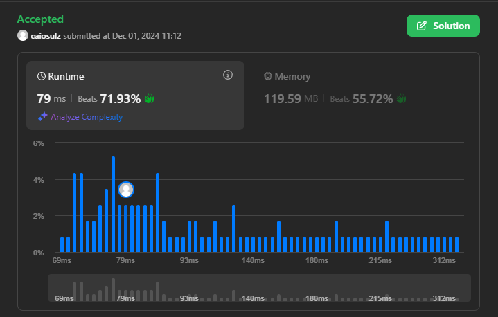
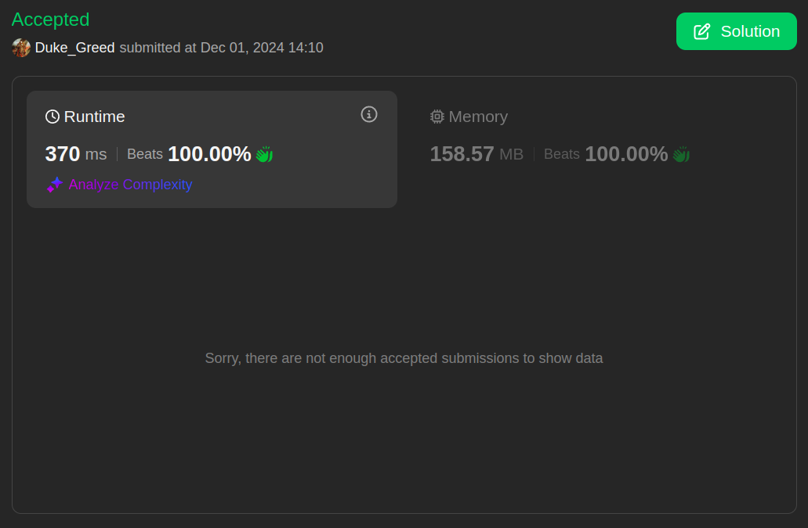
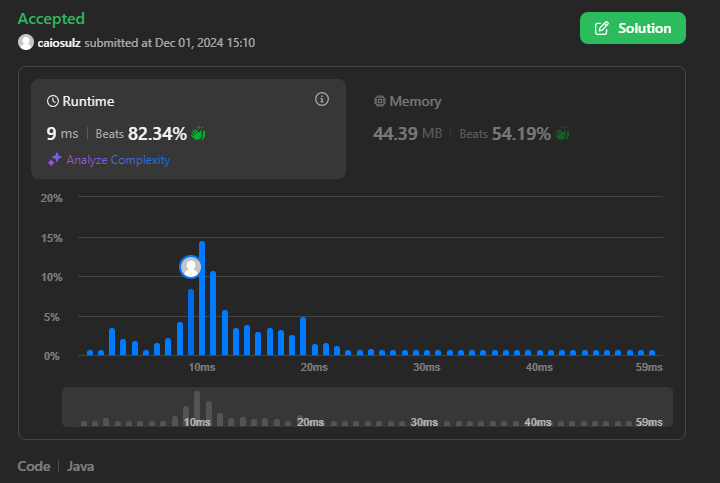

# Questões LeetCode

**Número da Lista**: 33 
**Conteúdo da Disciplina**: Grafos 2 

## Alunos
| Matrícula | Aluno                       |
|-----------|-----------------------------|
| 202046087 | Fabrício Macedo de Queiroz  |
| 202046004 | Caio Moreira Sulz Gonsalves |

## Sobre

Tendo em vista a aplição do conteúdo Grafos 2 (que envolve a aprendizagem dos seguintes algoritmos: Dijkstra, Prim e Kruskal) na prática, foram resolvidas 4 questões do site [LeetCode](https://leetcode.com/). Sendo elas, duas questões de nível Difícil (**_Hard_**) e duas de nível Médio (**_Medium_**).

## Linguagens

<table style="border: none; text-align: center;">
    <tr>
        <td>
            <strong>Dart</strong>
        </td>
        <td>
            <strong>Java</strong>
        </td>
    </tr>
    <tr>
        <td>
            
        </td>
        <td>
            
        </td>
</table>

## Questões

| Nível   | Link para a questão                                                                                                                                               | Linguagem |
|---------|-------------------------------------------------------------------------------------------------------------------------------------------------------------------|-----------|
| Médio   | [1584. Min Cost to Connect All Points](https://leetcode.com/problems/min-cost-to-connect-all-points/description/)                                                 | Dart      |
| Médio   | [3112. Minimum Time to Visit Disappearing Nodes](https://leetcode.com/problems/minimum-time-to-visit-disappearing-nodes/description/)                             | Java      |
| Difícil | [1368. Minimum Cost to Make at Least One Valid Path in a Grid](https://leetcode.com/problems/minimum-cost-to-make-at-least-one-valid-path-in-a-grid/description/) | Dart      |
| Difícil | [778. Swim in Rising Water](https://leetcode.com/problems/swim-in-rising-water/description/)                                                                                                                 | Java      |

## Uso / Manual de como Rodar

### Direto no LeetCode

1. É necessário ter uma conta no **LeetCode** e acessar uma das questões na tabela acima.

2. Copiar a resposta da referida questão no repositório.

3. Logo abaixo do título da aba **_"Code"_**, selecione a linguagem com a qual a solução disponível no repositório foi escrita.

4. Apague a definição de Classe que já vem escrita na IDE da aba **_"Code"_** e cole a solução copiada anteriormente.

5. Clique em **_"Run"_** na parte inferior da aba **_"Code"_**, para rodar os casos de teste e verificar se a solução está correta.

6. Caso deseje ter mais certeza acerca da solução, clique em **_"Submit"_**, com isso uma grande quantidade de outros casos de teste serão verificados e retornará o resultado final informando se a resposta está correta ou não. O lado negativo dessa opção é que o **LeetCode** salvará essa submissão na conta utilizada ao clicar em **_"Submit"_**.

### Alternativamente

- É possível rodar as soluções facilmente em sites como o [DartPad](https://dartpad.dev/), para a linguagem Dart, e o [JDoodle](https://www.jdoodle.com/online-java-compiler) para a linguagem Java.

- Vale ressaltar que sendo questões para o LeetCode, as soluções não possuem entrada de dados, sendo necessário modificar a solução para que a entrada de dados seja feita de forma manual. Ou seja, também não possuem o método `main()`. Tornando mais viável executá-las diretamente no LeetCode.

## Screenshots

Os Links nos títulos levam ao `.md` com detalhes acerca da solução de cada questão.

### [1584. Min Cost to Connect All Points](./Questions/Medium_1/Medium_1.md)

### [3112. Minimum Time to Visit Disappearing Nodes](./Questions/Medium_2/Medium_2.md)

### [1368. Minimum Cost to Make at Least One Valid Path in a Grid](./Questions/Hard_1/Hard_1.md)

### [778. Swim in Rising Water](./Questions/Hard_2/Hard_2.md)

## Vídeos Explicando as Questões

- ### Questão Média 1: [1584. Min Cost to Connect All Points](https://youtu.be/CHJT2zVBHEk)

- ### Questão Média 2: [3112. Minimum Time to Visit Disappearing Nodes](https://youtu.be/mKC41ZRdx-o?si=SJjZ58UGsaENvHlu&t=2)

- ### Questão Difícil 1: [1368. Minimum Cost to Make at Least One Valid Path in a Grid](https://youtu.be/SkLZj7A3uxY)

- ### Questão Difícil 2: [778. Swim in Rising Water](https://youtu.be/mKC41ZRdx-o?si=6LDgxcuA8GRPbRne&t=315)
